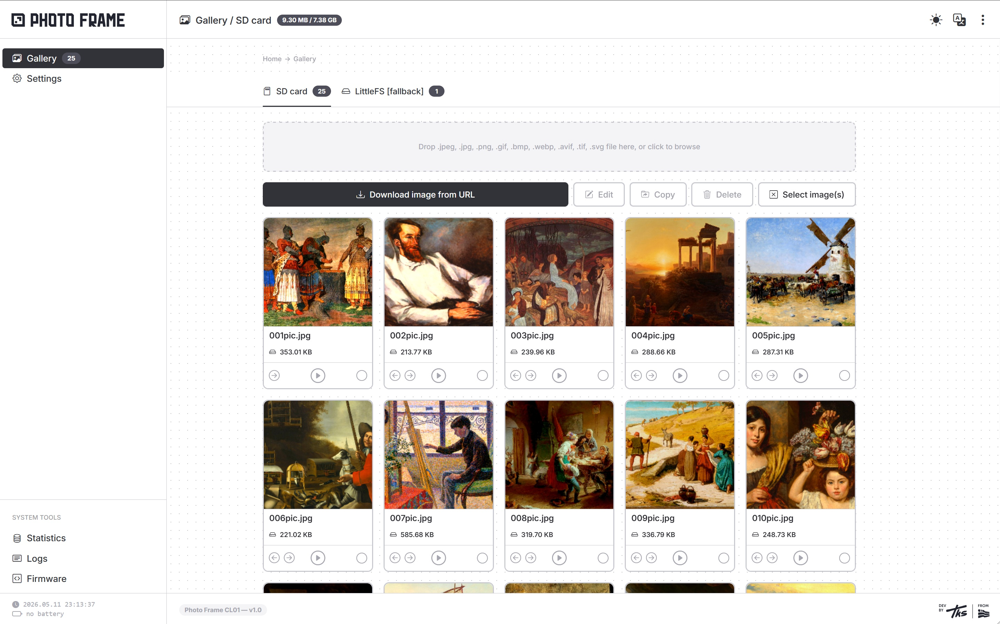

# Photo Frame CL01 (Spectra6 Color E-ink)

Color e-ink digital picture frame with WiFi-enabled admin dashboard, JPEG color rendering, and deep sleep operation with RTC backup for extended battery life.

> Display target in this repository is the color e-paper path (`EPD_7IN3E`, 800×480), also commonly referred to as Spectra6 class display.

> **📌 Note:** This project is designed for the newer **LilyGo T5 4.7" E-Paper Plus** (ESP32-S3). For the older **LilyGo T5 4.7" E-Paper** (WROVER-E) version, check out [PhotoFrameGS01](https://github.com/tokosattila/PhotoFrameGS01.git).

## 📸 Gallery

|  |  |  |  |  |
|:---:|:---:|:---:|:---:|:---:|
| *Display* | *Hardware* | *Backside* | *Detail* | *Detail* |

## 🔧 Hardware

<table width="100%">
<tr>
<td align="center" style="padding:10px!important">

| Component | Specification |
|-----------|--------------|
| **Board** | LilyGo T5 4.7" E-Paper Plus |
| **MCU** | ESP32-S3 |
| **Display** | EPD_7IN3E 800×480 color e-paper (Spectra6) |
| **Flash** | 16 MB |
| **PSRAM** | 8 MB (OPI) |
| **RTC** | PCF8563 (I2C, battery backup) |
| **Audio** | I2S codec (tone playback) |
| **Storage** | SD Card (SPI) + LittleFS (10 MB internal) |
| **Battery** | Li-Ion 18650 (optional) |

</td>
<td align="center">

</td>
</tr>
</table>

## 🔄 Operating Modes

| Mode | Trigger | Description |
|------|---------|-------------|
| **Photo Frame Mode** | Timer wake-up / power-on | JPEG slideshow from storage, deep sleep between frames |
| **Maintenance Mode** | Long-press Settings button | WiFi admin dashboard for full device management |
| **Low Battery Mode** | Auto-detect on boot | Battery icon display + deep sleep hibernation |

## ✨ Features

- **Dual Storage** — SD Card (primary) + LittleFS (internal flash) with automatic fallback
- **Cross-Storage Operations** — Copy, delete (including glob/batch) between SD Card and LittleFS
- **Color Rendering** — Brightness / contrast / saturation / gamma / per-channel RGB gain
- **JPEG Slideshow** — Sequential image display, next file persisted in NVS across deep sleep cycles
- **Scheduled Wake-up** — Timer-based sleep with configurable target hour (Daily / Weekly / Monthly)
- **Web Admin Dashboard** — Full-featured management UI served directly from the device (port 80)
- **Session Authentication** — Cookie-based token login with inactivity auto-restart
- **Firmware OTA (Dual Slot)** — Upload `firmware.bin` via dashboard, `ota_0` / `ota_1` with boot-slot control
- **NTP Time Sync** — Automatic sync with RTC backup; configurable low-power weekly sync
- **mDNS Support** — Access device via `hostname.local`
- **Battery Monitoring** — Voltage + percentage; auto low-battery shutdown
- **Audio Feedback** — I2S codec tone playback for mode transitions and alerts
- **Dynamic CPU Scaling** — Automatic 160 / 240 MHz switching based on active workload
- **Multilingual UI** — English and Hungarian dashboard languages

## 📁 Project Structure

```
src/
├── Main.cpp                        # Application entry point, mode routing
└── App/
    ├── Global.h                    # Global types, constants, macros
    ├── Battery.cpp/h               # ADC battery voltage monitoring
    ├── Button.cpp/h                # Debounced button with short/long press callbacks
    ├── Configuration.cpp/h         # NVS-based config load / save / factory reset
    ├── Connection.cpp/h            # WiFi AP / STA / fallback AP management
    ├── Dashboard.cpp/h             # Async web server, REST API, session management
    ├── Display.cpp/h               # E-Paper driver wrapper + JPEG color rendering
    ├── Firmware.cpp/h              # OTA firmware update manager
    ├── Led.cpp/h                   # Activity LED control
    ├── NTP.cpp/h                   # NTP time synchronization
    ├── RTC.cpp/h                   # PCF8563 real-time clock driver
    ├── Sound.cpp/h                 # I2S codec tone/sound playback
    ├── Storage.cpp/h               # Unified storage manager with fallback
    ├── Utils.cpp/h                 # System utilities, glob matching, file ops
    ├── Dashboard/
    │   ├── Assets/                 # CSS, JS, icon assets (PROGMEM)
    │   ├── Components/             # Reusable HTML components
    │   ├── Languages/              # En.h, Hu.h translation registries
    │   ├── Pages/                  # HTML page definitions (PROGMEM)
    │   │   ├── Index.h             # Gallery / image management
    │   │   ├── Display.h           # Color rendering settings
    │   │   ├── Firmware.h          # OTA firmware upload
    │   │   ├── Network.h           # WiFi AP / STA configuration
    │   │   ├── Ntp.h               # NTP server settings
    │   │   ├── DateTime.h          # Manual date/time override
    │   │   ├── WakeUp.h            # Deep sleep schedule settings
    │   │   ├── Mdns.h              # mDNS hostname settings
    │   │   ├── Language.h          # UI language selection
    │   │   ├── Settings.h          # Dashboard settings (theme, CPU scaling…)
    │   │   ├── User.h              # Admin credentials
    │   │   ├── Stats.h             # Device statistics
    │   │   └── Registry.h          # NVS key browser
    │   └── Utils/                  # Dashboard helper functions
    ├── Fonts/                      # OpenSans bitmap fonts (display text)
    ├── Images/                     # Default fallback image (PROGMEM)
    └── Sounds/                     # Tone arrays for audio feedback
```

## ⚙️ Mechanisms

### Configuration (NVS)

All configuration is stored in NVS (non-volatile storage) via the `Preferences` library. On first boot, `Configuration_::Init()` detects a missing config key and writes a full default config. Every setting has a dedicated NVS key (e.g. `dsh.cpu.dyn`, `dsp.brightness`). Factory reset wipes all NVS keys and reboots.

### Storage Fallback

`Storage_` wraps both `SDCard_` and `LittleFS_` behind a unified interface. At init, the configured primary storage is tried first. If the images folder is empty or the storage is unavailable, and `FallbackEnabled = true`, the secondary storage is automatically selected. Cross-storage copy and glob-based batch delete work on both backends.

### Deep Sleep & Wake-up

In Photo Frame Mode the device renders the current JPEG, powers off the display, then calls `esp_sleep_enable_timer_wakeup()` with the computed sleep duration and enters deep sleep. The next image filename is persisted in NVS before sleeping so the slideshow resumes correctly after any wake-up. Wake-up sources: timer (via `esp_timer`) and button press (GPIO EXT1). For Daily / Weekly / Monthly modes the exact remaining seconds until `wake_up_hour` are calculated from the RTC.

| Timer Mode | Interval | `wake_up_hour` used |
|------------|----------|---------------------|
| Seconds | ~60 sec | No |
| Minutes | ~1 min | No |
| Hourly | 1 hour | No |
| Half-day | 12 hours | No |
| **Daily** | 24 hours | Yes |
| **Weekly** | ~7 days | Yes |
| **Monthly** | ~30 days | Yes |

### Dynamic CPU Scaling

During Maintenance Mode the CPU frequency is managed automatically by `Dashboard_::EvaluateCpuPerformance()`, called every second from `DashboardTask`. Frequency switches only when state actually changes (no redundant calls).

| Workload | Trigger | Frequency | Hold window |
|----------|---------|-----------|-------------|
| Page navigation | `/api/page`, `index.html`, `firmware.html` | 240 MHz | 6 s |
| Image / media ops | `/api/images/*` | 240 MHz | 10 s |
| OTA upload | `/api/ota/*` | 240 MHz | 45 s |
| Idle | — | 160 MHz | — |

Can be disabled from **Settings → Dynamic CPU Scaling** (NVS key: `dsh.cpu.dyn`).

### Session Management

The dashboard uses cookie-based session tokens. On `POST /api/login` a 64-char hex token is generated (SHA-256 of username + password + random salt), stored server-side in a fixed-size session table, and sent as an `HttpOnly` cookie. Every authenticated request validates the cookie against the table and resets the `LastSeenMs` timestamp — this is also used as the activity signal for the inactivity timeout.

Expired or invalid tokens get a `401` redirect to `/login`. Sessions are purged periodically; the table size limits concurrent sessions.

### Inactivity Timeout (Maintenance Mode)

`MaintenanceMode()` loops with a 1-second tick. It reads `DSH.GetLastActivityMs()` (last authenticated API call) and compares it against the timeout constant (`MAINTENANCE_INACTIVITY_TIMEOUT_MS = 10 min`). On expiry the device shuts down the dashboard, display, storage, and WiFi cleanly, then calls `esp_restart()` to return to Photo Frame Mode.

### Firmware OTA (Dual Slot)

The partition table has two equal 3 MB app slots (`ota_0`, `ota_1`) controlled by `otadata`. OTA upload streams `firmware.bin` via `POST /api/ota/upload` directly into the inactive slot using the Arduino `Update` library. On success the boot pointer is flipped to the new slot and the device reboots. The Firmware dashboard page shows the running and boot slot and allows manual slot override.

A plain USB flash typically writes to `ota_0` at `0x10000`. If the device reboots to the wrong slot, set it explicitly from the Firmware page.

## 🖥️ Admin Dashboard

The device serves a web admin dashboard during **Maintenance Mode** on port 80. All HTML, CSS, JS and assets are stored as `PROGMEM` strings in header files — no filesystem access required for the UI.

**Default credentials:** `admin` / `admin`  
The password is stored as a SHA-256 hash in NVS and can be changed from the User page.

**Access URL:**
- mDNS: `http://photoframecl01.local/`
- AP mode: `http://192.168.4.1/`
- STA mode: `http://<device-ip>/`

### Pages

| Page | URL | Description |
|------|-----|-------------|
| **Gallery** | `/index.html` | Browse, upload, delete, copy, set active image |
| **Display** | `/display.html` | Brightness, contrast, saturation, gamma, RGB gain |
| **Firmware** | `/firmware.html` | OTA upload, boot slot status and override |
| **Network** | `/network.html` | AP / STA / fallback AP / static IP settings |
| **NTP** | `/ntp.html` | NTP server, GMT offset, daylight saving, force sync |
| **Date & Time** | `/datetime.html` | Manual RTC date/time override |
| **Wake-up** | `/wakeup.html` | Deep sleep schedule and target hour |
| **mDNS** | `/mdns.html` | mDNS hostname |
| **Language** | `/language.html` | UI language (EN / HU) |
| **Settings** | `/settings.html` | Theme, CPU scaling, image dimensions |
| **User** | `/user.html` | Admin username / password |
| **Stats** | `/stats.html` | Flash, RAM, CPU, uptime, battery |
| **Registry** | `/registry.html` | NVS key browser |

### REST API

| Endpoint | Method | Description |
|----------|--------|-------------|
| `/api/login` | POST | Authenticate, receive session cookie |
| `/api/logout` | POST | Invalidate session |
| `/api/page` | GET | Load page HTML by key |
| `/api/images` | GET | List images on active storage |
| `/api/images/<name>` | GET | Download image file |
| `/api/images/thumb/<name>` | GET | Download thumbnail |
| `/api/images/thumbs/` | GET | Batch thumbnail listing |
| `/api/images/upload` | POST | Upload image file |
| `/api/images/copy` | POST | Copy image between storages |
| `/api/images/import-url` | POST | Import image from URL |
| `/api/images/delete` | POST | Delete image(s), supports glob |
| `/api/images/swap` | POST | Move image to other storage |
| `/api/images/default` | POST | Set active display image |
| `/api/status` | GET | Device status JSON |
| `/api/stats` | GET | Detailed system statistics |
| `/api/config` | GET | Current configuration JSON |
| `/api/config/save` | POST | Save configuration |
| `/api/display/save` | POST | Save color rendering settings |
| `/api/network/save` | POST | Save WiFi settings |
| `/api/mdns/save` | POST | Save mDNS settings |
| `/api/ntp/save` | POST | Save NTP settings |
| `/api/ntp/sync` | POST | Force NTP sync |
| `/api/datetime/save` | POST | Set RTC date and time manually |
| `/api/language/save` | POST | Save UI language |
| `/api/user/save` | POST | Change admin credentials |
| `/api/user/restore` | POST | Restore default admin credentials |
| `/api/wakeup/save` | POST | Save deep sleep schedule |
| `/api/ota/status` | GET | OTA partition slot status |
| `/api/ota/upload` | POST | Upload firmware binary |
| `/api/reboot` | POST | Restart → Maintenance Mode |
| `/api/restart` | POST | Restart → Photo Frame Mode |
| `/api/factory/reset` | POST | Wipe NVS and restart |
| `/api/rtc/sync` | POST | Sync RTC from system time |
| `/api/rtc/now` | GET | Current RTC time |

## 🛠️ Build

### Requirements

- [PlatformIO](https://platformio.org/) IDE or CLI
- ESP32-S3 Arduino framework (`espressif32`)

### Commands

```bash
# Build firmware
pio run -e photo_frame_cl_01

# Upload firmware
pio run -e photo_frame_cl_01 -t upload

# Upload LittleFS image (initial provisioning)
pio run -e photo_frame_cl_01 -t uploadfs

# Run native unit tests
pio test -e native

# Serial monitor
pio device monitor
```

### Partition Layout

| Partition | Type | Size | Description |
|-----------|------|------|-------------|
| `nvs` | data/nvs | 16 KB | Configuration storage |
| `otadata` | data/ota | 8 KB | OTA boot slot tracking |
| `ota_0` | app | 3072 KB | Firmware slot 0 |
| `ota_1` | app | 3072 KB | Firmware slot 1 |
| `littlefs` | data | 10112 KB | Internal file storage |
| `coredump` | data | 64 KB | Crash dump |

## 🔌 Pin Configuration

| GPIO | Function | Description |
|------|----------|-------------|
| GPIO4 | Btn1 | Next image (dev mode only) |
| GPIO0 | Btn2 | Factory reset (hold 30 sec) |
| GPIO5 | Btn3 | Enter Maintenance Mode (long-press) |
| GPIO42 | ActLed | Activity LED |
| GPIO47 | I2C SDA | RTC (PCF8563) + Audio codec |
| GPIO48 | I2C SCL | RTC (PCF8563) + Audio codec |
| GPIO14 | I2S MCLK | Audio codec master clock |
| GPIO16 | I2S WS | Audio codec word select |
| GPIO15 | I2S BCLK | Audio codec bit clock |
| GPIO17 | I2S DOUT | Audio codec data out |
| GPIO7 | Codec PA | Audio power amplifier enable |
| GPIO40 | SD MISO | SD Card data out |
| GPIO41 | SD MOSI | SD Card data in |
| GPIO39 | SD SCK | SD Card clock |
| GPIO38 | SD CS | SD Card chip select |

## 🧪 Testing

Unit tests run on the native host environment — no hardware required:

```bash
pio test -e native
```

| Suite | Coverage |
|-------|----------|
| `test_BootPartitionCommand` | OTA boot slot command parsing |
| `test_Button` | Debounce, short/long press callbacks |
| `test_ConfigCommand` | Config key/value command parsing |
| `test_Configuration` | NVS config round-trip, defaults |
| `test_DashboardCpuScaling` | CPU demand window logic, page key routing, inactivity timeout |
| `test_DashboardInternetEnable` | AP/STA internet flag mapping |
| `test_DashboardStats` | File size formatting |
| `test_DateCommand` | Date/RTC command parsing |
| `test_ESP32` | ESP32-specific utility assertions |
| `test_MainWakeRouting` | Boot mode decision logic |
| `test_NTP` | NTP time utility functions |
| `test_RTC` | PCF8563 time math |
| `test_SDCard` | SD Card path and file utilities |
| `test_Sound` | Sound sequence logic |
| `test_Storage` | Storage fallback routing |
| `test_Utils` | Glob matching, path parsing, string utils |

## 📦 Dependencies

| Library | Purpose |
|---------|---------|
| [AsyncTCP](https://github.com/me-no-dev/AsyncTCP) | Async TCP stack |
| [EPaperDriver](lib/EPaperDriver) | Color e-paper low-level driver (local) |
| [ESPAsyncWebServer](https://github.com/me-no-dev/ESPAsyncWebServer) | Async HTTP server |
| [JPEGDEC](https://github.com/bitbank2/JPEGDEC) | JPEG decoder |
| [Unity](https://github.com/ThrowTheSwitch/Unity) | Unit testing framework |

## 📄 License

MIT License

Copyright (c) 2025–2026 Szeklerman
