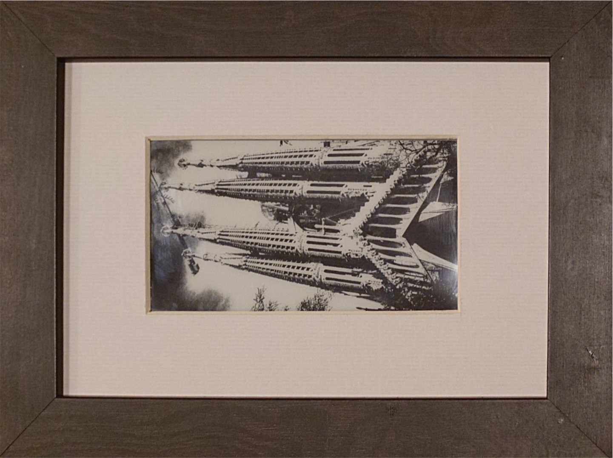
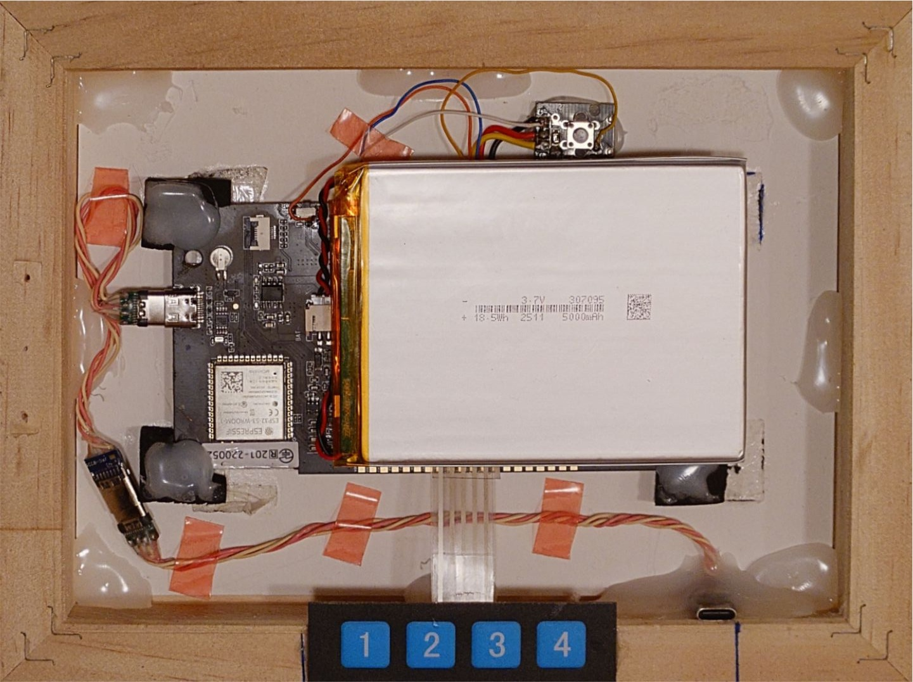
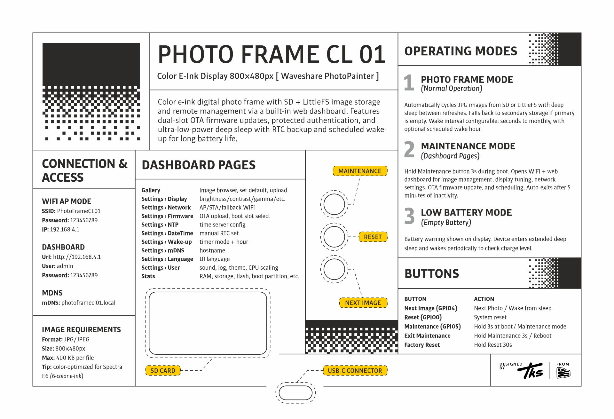
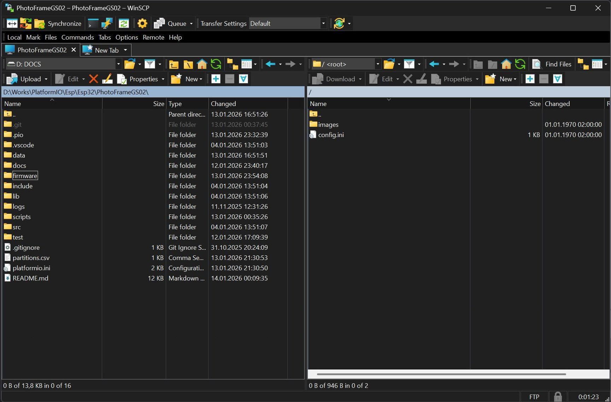

# Photo Frame CL01 (Spectra E6 Color E-Ink)

Color e-ink digital photo frame with image management and configuration via a built-in web dashboard. Features deep sleep scheduling with RTC backup, dual OTA firmware update slots, and NVS-backed configuration for extended autonomous operation.

> **📌 Note:** This project targets the **Waveshare ESP32-S3-PhotoPainter 7.3 inch E6 Full Color E-paper**. For the grayscale variant based on the **LilyGo T5 4.7 inch E-Paper Plus** ESP32-S3 version, see [PhotoFrameGS02](https://github.com/tokosattila/PhotoFrameGS02.git), for the older **LilyGo T5 4.7 inch E-Paper** WROVER-E version, check out [PhotoFrameGS01](https://github.com/tokosattila/PhotoFrameGS01.git).

The project is designed around three goals:
1. Low-power autonomous image display with deep sleep.
2. Reliable maintenance workflows through a built-in web dashboard.
3. Robust field operation with NVS-backed configuration, dual OTA partitions, and storage fallback.

## 1. Photo & Video

|  |  |
|:---:|:---:|
| *Photo frame in operation* | *Hardware back side* |

|  | <video src="https://github.com/tokosattila/PhotoFrameCL01/raw/main/docs/videos/video.mp4" width="390px" controls></video> |
|:---:|:---:|
| *Back cover installed* | *Dashboard video* |

## 3. Hardware

<table width="100%">
<tr>
<td align="center" style="padding:10px!important">

| Component | Specification |
|-----------|--------------|
| **Board** | ESP32-S3-WROOM-1-N16R8 (Waveshare) |
| **MCU** | ESP32-S3 |
| **Display** | 7.3 inch Spectra E6, full color e-paper, 800x480px |
| **Flash** | 16MB |
| **PSRAM** | 8MB |
| **RTC** | PCF8563 I2C RTC chip |
| **Storage** | SD Card SPI |
| **Audio** | ES8611 I2S DAC audio encoder chip |
| **Battery** | AXP2101 PMU I2C Li-Ion battery management |

</td>
<td align="center"> 

</td>
</tr>
</table>

## 4. System Architecture

The runtime is organized into focused modules under `src/App`:

- `Configuration_`: NVS persistence and defaults.
- `Storage_`: unified SD/LittleFS abstraction with fallback.
- `Display_`: e-paper rendering, JPEG tuning pipeline, text/graphics primitives.
- `Dashboard_`: async web server, authentication/session layer, API routing.
- `Connection_`: AP/STA networking, optional mDNS.
- `Firmware_`: OTA stream handling to inactive partition.
- `NTP_` + `RTC_`: time sync and clock persistence.
- `Battery_` + `Sound_` + `Led_` + `Button_`: device peripherals and UX signals.
- `LogManager_`: file-based event logger with per-level structured output, daily file rotation, and runtime enable/disable control via NVS config.
- `Utils_`: sleep/wakeup logic, CPU frequency switching, diagnostics.

The application entrypoint in `src/Main.cpp` orchestrates initialization and mode routing.

## 5. Boot Sequence and Operating Modes

### 5.1 Boot Sequence

Startup flow (high level):

1. Init config (NVS), load defaults if first boot.
2. Init utility/peripheral stack (clock, RTC sync, battery, audio, LED).
3. Evaluate low battery condition.
4. Route into mode based on wake source and button state.

### 5.2 Photo Frame Mode

Purpose: autonomous slideshow operation with low power consumption.

Core behavior:

- Mount storage.
- Resolve current image from persisted config.
- Render JPEG using current display tuning.
- Persist next image pointer.
- Power down subsystems.
- Enter deep sleep with timer/button wake source.

If the current image is missing or unreadable, a built-in fallback image is shown.

### 5.3 Maintenance Mode

Purpose: online configuration and administration via local web dashboard.

Core behavior:

- Bring up WiFi (AP or STA according to config).
- Start async dashboard server.
- Show admin URL on display.
- Serve all configuration, media, and OTA endpoints.
- Track user activity for inactivity timeout handling.

Maintenance mode is intended for bounded interaction windows, then automatic return to photo-frame behavior.

### 5.4 Low Battery Mode

Purpose: protect battery and avoid unstable operation.

Core behavior:

- Play low-battery tone.
- Draw battery warning state to display.
- Enter low-power sleep path.

## 6. Configuration

Configuration is fully NVS-backed via `Preferences`.

On first boot, defaults are created and persisted by `Configuration_::Init()`.

Configuration domains include:

- Device identity and pin assignment.
- Display rendering parameters (brightness/contrast/gamma/saturation/RGB gains/rotation).
- WiFi AP/STA + fallback + mDNS.
- NTP/RTC and wake scheduling.
- Storage defaults and fallback policy.
- Dashboard settings (language/theme/session-related options, dynamic CPU scaling).
- Boot count (auto-incremented each startup, persisted in NVS).
- LogManager enable/disable flag (controls file-based event logging at runtime).

Factory reset clears NVS config and reboots.

## 7. Power, Sleep, and Wake Mechanisms

### 7.1 Wake Scheduling

Timer modes are enum-based and support:

- Minutes
- Hourly
- Half-day
- Daily
- Weekly
- Monthly

For Daily/Weekly/Monthly, `wake_up_hour` is respected; shorter interval modes ignore hour targeting.

### 7.2 Deep Sleep Strategy

Photo Frame mode calculates sleep target and enters deep sleep after render completion.

Wake sources include timer and button-triggered wake logic.

### 7.3 CPU Frequency Control

Baseline in maintenance is 160 MHz.

Dynamic high-performance windows are activated on dashboard workloads:

- Page navigation: 6 s hold
- Media/image operations: 10 s hold
- OTA operations: 45 s hold

If no high-demand workload remains active, frequency returns to 160 MHz.

## 8. Session and Security Model

Dashboard authentication is cookie-token based.

- Login endpoint validates user credentials.
- Session token is issued and stored in bounded session table.
- Protected endpoints require valid token.
- Expired/invalid sessions are rejected and redirected to login.
- Activity timestamps are updated on authenticated calls.
- If no dashboard password is configured, maintenance access is treated as passwordless and protected pages are available without a session token.

The activity timestamp is reused by maintenance inactivity logic to decide automatic restart.

Security notes:

- HTTP only (no TLS termination on device).
- Single-admin credential model.
- Password stored as SHA-256 hash in NVS.

## 9. Maintenance Inactivity Mechanism

Maintenance loop checks last authenticated dashboard activity once per second.

When inactivity reaches `MAINTENANCE_INACTIVITY_TIMEOUT_MS` (currently 5 minutes), the firmware:

1. Stops dashboard services.
2. Powers down display/storage/network cleanly.
3. Calls `esp_restart()`.
4. Returns to default boot path (Photo Frame mode).

This avoids leaving the device in permanent maintenance state.

## 10. Storage and Media Pipeline

`Storage_` unifies SD Card and LittleFS behind one interface.

Behavior:

- Select configured primary storage when available.
- If unavailable/empty and fallback enabled, switch to secondary storage.
- Ensure image directory availability.
- Provide list/read/write/delete/copy/move flows used by dashboard APIs.

Media operations exposed in dashboard include:

- Upload
- Import from URL
- Thumbnail serving
- Delete (including pattern-based operations)
- Cross-storage copy/swap
- Set current/default image

## 11. Display Rendering Pipeline

`Display_` wraps low-level e-paper driver operations and rendering policies.

Main responsibilities:

- JPEG decode and render to Spectra6-compatible output.
- Apply user-configurable tuning (brightness/contrast/gamma/saturation/channel gains).
- Text and shape primitives for status screens.
- Rotation support.
- Controlled update and power-off behavior for e-paper lifecycle.

## 12. Networking and Time Services

### 12.1 Connectivity

`Connection_` supports AP and STA operation with fallback behavior.

Capabilities:

- AP mode for local maintenance access.
- STA mode for network-integrated deployments.
- Optional mDNS hostname publishing.
- Client presence checks used by maintenance UX.

### 12.2 Time Management

`NTP_` and `RTC_` cooperate to keep time stable across deep sleep cycles.

- NTP sync updates system clock.
- RTC stores time persistently with backup source.
- Wake-hour scheduling uses RTC/system time computations.

## 13. Firmware Update (OTA) and Partitioning

Partition design (`partitions.csv`):

- `ota_0` and `ota_1` (equal app slots)
- `otadata` for active boot slot metadata
- `littlefs` data partition
- `nvs` config partition

OTA flow:

1. Upload new firmware through dashboard OTA endpoint.
2. Stream into inactive slot.
3. Validate and finalize image.
4. Flip boot target.
5. Reboot into new firmware.

This provides rollback-friendly dual-slot behavior for remote updates.

The dashboard also exposes the currently running boot partition in the Stats flash section. The User settings page can select the boot target for the next restart (`OTA 0` or `OTA 1`). A target slot is accepted only when it contains a valid firmware image; empty or invalid OTA slots are rejected before the boot target is changed.

## 14. Dashboard (Detailed)

The dashboard is a first-class subsystem with embedded assets and API-driven interactions.

### 14.1 Pages

Implemented pages include:

* Login
* Index/Gallery
* Settings
  - Display
  - Firmware
  - Network
  - NTP
  - Date & Time
  - Wake-up
  - mDNS
  - Language
  - User (includes sound, LogManager enable, boot target selection, and other user preferences)
- Stats (includes active boot partition in the Flash section)
- Error

These are served from compiled assets (`Dashboard/Pages`, `Dashboard/Assets`, `Dashboard/Languages`).

### 14.2 API Groups

API surface is organized around:

- Authentication (`/api/login`, `/api/logout`)
- Page and status (`/api/page`, `/api/status`, `/api/stats`)
- Media (`/api/images*`)
- Configuration saves (`/api/*/save` endpoints)
- Time sync (`/api/ntp/sync`, `/api/rtc/*`)
- OTA (`/api/ota/*`)
- Boot target selection (`/api/user/boot-target/save`)
- System actions (`/api/reboot`, `/api/restart`, `/api/factory/reset`)

### 14.3 Runtime Behaviors

Dashboard runtime includes:

- Session purge and validation.
- Cached status/stats refresh intervals.
- Optional WebSocket updates.
- CPU demand marking for performance windows.
- Activity timestamp updates for inactivity timeout.

### 14.4 Full Endpoint Inventory

Authentication and navigation:

- `GET /`
- `GET /login`
- `GET /login.html`
- `POST /login`
- `POST /login.html`
- `GET /error`
- `GET /error.html`
- `GET /api/page`
- `POST /api/login`
- `POST /api/logout`

Images and media:

- `GET /api/images`
- `GET /api/images/<name>`
- `GET /api/images/thumb/<name>`
- `GET /api/images/thumbs/<name or pattern>`
- `POST /api/images/upload`
- `POST /api/images/copy`
- `POST /api/images/import-url`
- `POST /api/images/delete`
- `POST /api/images/swap`
- `POST /api/images/default`

Status and configuration:

- `GET /api/status`
- `GET /api/config`
- `POST /api/config/save`
- `POST /api/display/save`
- `POST /api/network/save`
- `POST /api/mdns/save`
- `POST /api/ntp/save`
- `POST /api/ntp/sync`
- `POST /api/datetime/save`
- `POST /api/language/save`
- `POST /api/user/save`
- `POST /api/user/restore`
- `POST /api/user/boot-target/save`
- `POST /api/wakeup/save`
- `GET /api/stats`

OTA and system actions:

- `GET /api/ota/status`
- `POST /api/ota/upload`
- `POST /api/reboot`
- `POST /api/restart`
- `POST /api/factory/reset`
- `POST /api/rtc/sync`
- `GET /api/rtc/now`

WebSocket and static assets:

- `GET /ws` (WebSocket upgrade)
- Static pages, scripts, styles, SVG/images, and language assets served from embedded PROGMEM resources

## 15. Build and Deployment

Project uses PlatformIO (`platformio.ini`) with `photo_frame_cl_01` as default env.

Key build characteristics:

- C++17
- ESP32-S3 board config
- 16 MB flash partition layout
- 8 MB PSRAM OPI
- Post-build firmware export script: `scripts/firmware.py`

Typical commands:

```bash
pio run -e photo_frame_cl_01
pio run -e photo_frame_cl_01 -t upload
pio run -e photo_frame_cl_01 -t uploadfs
pio device monitor
```

## 16. Tooling and Utility Scripts

`scripts/` contains project tooling for asset and firmware workflows:

- `firmware.py`: post-build firmware artifact handling.
- `bmp6_to_hex.py`: bitmap conversion to project-friendly C representation.
- `fontconvert.py`: font asset conversion pipeline.
- `ConvertTo6C/`: palette conversion utilities for Spectra6 preparation.

These tools support repeatable asset preparation and deployment packaging.

## 17. Dependencies

Project dependencies are managed via PlatformIO's library system (`platformio.ini`):

**Core Libraries:**
- `AsyncTCP`: asynchronous TCP stack for ESP32
- `ESPAsyncWebServer`: high-performance async HTTP server
- `JPEGDEC`: JPEG decoder optimized for embedded systems
- `Unity`: unit testing framework (native environment)

**Hardware Drivers:**
- `EPaperDriver`: abstraction layer for e-paper display operations
- Board support packages for ESP32-S3

**Build Dependencies:**
- PlatformIO toolchain (gcc-arm-none-eabi, esptool.py)
- Python 3.x for build scripts

All dependencies are fetched automatically during build. See `platformio.ini` for pinned versions.

## License

MIT License

Copyright (c) 2025-2026 Szeklerman
